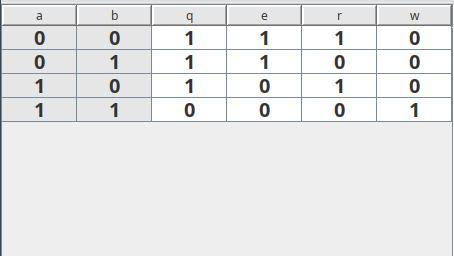

# Tugas Asistensiku

## Global

1. Sholat 5 waktu
2. Gk bisa ngerjain berarti anak ITB, kalo bisa ngerjain baru bisa dibilang anak ITS
3. Anggaplah teman sekelompok kalian semuanya sampah

## P1

1. Sebutkan toko-toko elektronik di surabaya dan daerah mana tokonya berada
2. Apa itu floating input?
3. Bagaimana cara menyelesaikan ketika rangkaian kita terdapat floating input?

## P2

Input source: USB atau baterai, saya rekomendasi USB saja di Berkat banyak  
Logic unit: 1 buah IC 7400  
Output debug: 4 Led saja, atau sediakan 4 tempat untuk dicek pakai avometer  
Board: PCB dot (soldered) atau Breadboard saja gk papa

Truth Table:  

1. Buatkan saya rangkaiannya (bentuk pake IC langsung) (kalo bisa di hardware langsung. kalo gabisa, simulasi di proteus atau LTSpice)

## P3

1. ...
2. .... juga :v

## P4

1. ... juga :v :V :V
2. titik dua ve :v

## P5

1. Buat rangkaian UART Transmitter (8N1) menggunakan shift register (simulasi saja)

## Link penting

https://www.youtube.com/@BenEater/featured

`Kalo bingung, tanya aja`
